# AI Company Mission Control

Local-first orchestration platform for supervised AI software-development workflows.

## Screenshots

The Dashboard is the system overview: active objectives, agents online, pending approvals, live
runtime state, per-service health for the API, database, Redis, both gateways and the event stream,
plus the durable **Provider performance** report comparing Codex and Claude mission outcomes.

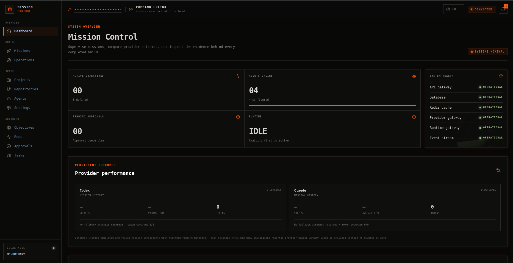

The Missions screen is the whole guided workflow on one page. Describe the build, optionally attach
reference images, watch the plan, review, build, and done stages advance, and use the completion
panel to open the project in VS Code, run its tests, or launch a local preview.

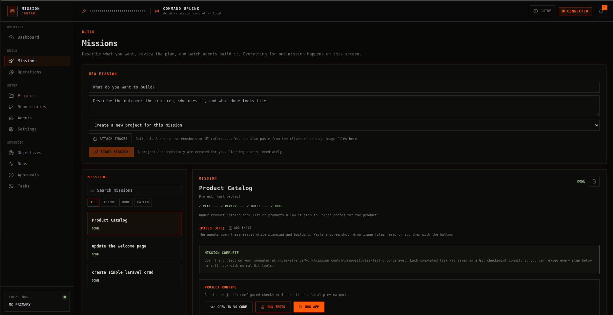

## Current scope

This repository contains a Next.js dashboard, FastAPI API, Dramatiq workers, PostgreSQL,
Redis, migrations, health monitoring, authenticated realtime transport, durable job dispatch,
an isolated provider gateway for Claude Code and Codex CLI, and a separate credential-free runtime
gateway for project tests and previews. Approved execution runs can edit registered repositories
and record Git checkpoint commits through the provider gateway. Every provider invocation and
project test command runs inside a disposable container created by a token-protected sandbox
supervisor. Finished projects can be opened in VS Code on the host, run and previewed locally, or
downloaded as a zip archive.

## Requirements

- Docker Engine with Docker Compose v2
- GNU Make (optional)

## Start locally

```bash
make up
```

That is the whole first-run setup. `make up` creates `.env` from `.env.example` with strong
generated values for `LOCAL_ADMIN_TOKEN`, `PROVIDER_GATEWAY_TOKEN`, and
`RUNTIME_GATEWAY_TOKEN`, plus the internal `SANDBOX_SUPERVISOR_TOKEN` (rerunning it never
overwrites existing values and adds missing tokens when upgrading an older `.env`), then builds
and starts the stack. Without GNU Make, run the
equivalent by hand: copy `.env.example` to `.env`, replace all token placeholders with independent
long random values, and run `docker compose up --build`.

The first build installs both provider CLIs into the `provider-gateway` image. The gateway runs
as a non-root user, has no Docker socket, and only accepts workspaces under `/workspaces`.
Dynamic containers are created by a separate, token-protected supervisor with a narrow API.

Open:

- Dashboard: http://localhost:3000
- API documentation: http://localhost:8000/docs
- API health: http://localhost:8000/api/v1/health

The dashboard signs in automatically in local development: the API serves the admin token from
`GET /api/v1/auth/local-session`, which is enabled only when `ENVIRONMENT=development`,
`AUTO_ADMIN_LOGIN=true`, and a real (non-placeholder) token is configured. The API port is bound
to `127.0.0.1` and CORS is restricted to the dashboard origin. Set `AUTO_ADMIN_LOGIN=false` and
enter the token manually in the top bar before exposing the service beyond localhost. The
realtime endpoint authenticates with the same admin token using the WebSocket subprotocol header;
workflow events are never available to an unauthenticated socket.

The top bar carries two aids for a new install. **Guide** opens a short walkthrough of connecting a
provider, starting a mission, approving a plan, and verifying or undoing the result; it can be
reopened at any time. The bell beside it is the notification center, which collects workflow events
from the realtime stream so an approval or a failure is not missed while another screen is open.

## Authenticate the provider gateway

Open <http://localhost:3000/settings> and press **Connect** on a provider card.

- **Codex** shows a sign-in link and a one-time code. Open the link, enter the code, and the
  card flips to connected automatically.
- **Claude** shows a sign-in link. Sign in, copy the code the page gives you, and paste it into
  the card.

The Missions screen shows a reminder banner while any provider is disconnected. Sign-in runs the
provider's own CLI login inside the gateway container; the resulting credentials are stored in
named Docker volumes, survive gateway rebuilds, and are never displayed or stored by the
dashboard. A pending sign-in expires after ten minutes and can be cancelled at any time.

The equivalent terminal commands remain available:

Codex subscription login:

```bash
docker compose run --rm --no-deps provider-gateway codex login --device-auth
```

Claude subscription login:

```bash
docker compose run --rm --no-deps provider-gateway claude auth login
```

## Build with Missions

Open <http://localhost:3000/missions> for the guided workflow. Describe what you want to build,
press **Start mission**, and everything else happens on that one screen: a project is created
automatically (or pick an existing one), the planner drafts tasks, you review and approve the
plan and its acceptance criteria inline, press **Build project**, and watch the tasks complete.
After implementation, an enabled reviewer agent inspects the final repository in read-only mode
and records evidence against every acceptance criterion. Before that review, Mission Control runs
the project's configured test command, or its detected Node/Laravel default, and stores the command,
exit code, and rolling output with the mission. A failing or errored deterministic test blocks
completion even if the reviewer approves every criterion. When no test command can be configured or
detected, the evidence is explicitly marked skipped rather than silently treated as a passing test.
The mission is marked complete only when every criterion and every available deterministic gate
passes. Failed criteria and their evidence remain on the mission instead of being reported as a
successful build. Execution failures surface on the same screen with a retry action.

A mission can carry reference images. Use **Attach images** on the new-mission form, or **Add image**
on an existing mission, to paste from the clipboard, drop files, or pick them from disk. Up to six
images of at most 5 MB each are kept per mission, and the stored type comes from the file signature
rather than the browser's declared content type. Planner and developer agents receive the file paths,
so an error screenshot or a UI reference is read as part of the brief instead of being described in
prose.

The sections below describe the underlying pieces. The Objectives, Runs, Approvals, and Tasks
pages remain available under **Advanced** in the sidebar for step-by-step control and detailed
timelines; nothing about their behavior changed.

## Register a project and repository

Set `REPOSITORY_HOST_ROOT` in `.env` to the host directory containing the repositories you want Mission Control to inspect. The container always sees this directory as `/repositories`; repository registration accepts a path relative to that root (for example, `my-app`).

```bash
docker compose up -d --build
```

Open <http://localhost:3000/projects> (the admin session is established automatically in local development) and create a project. Use this page to record project-specific instructions and to override the test and app commands.

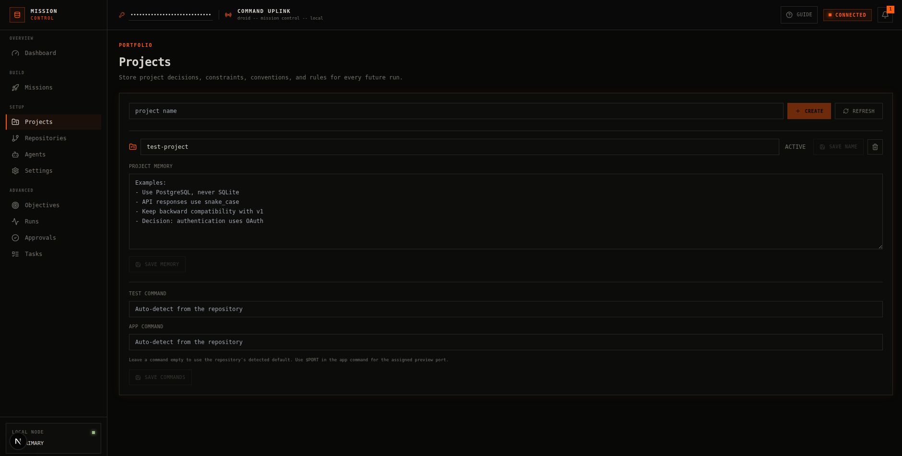

Then open <http://localhost:3000/repositories>. This page is optional advanced setup, because **Build project** creates a repository for you when a project has none. It offers two paths: **Create a project repository** initializes a new Git repository under the repository root, and **Register an existing repository** attaches a path relative to that root (for example, `my-app`). Each registered repository lists its host path with a copy button, and carries actions to open it in VS Code, download it as a zip, rename it or change its default branch, and unregister it.

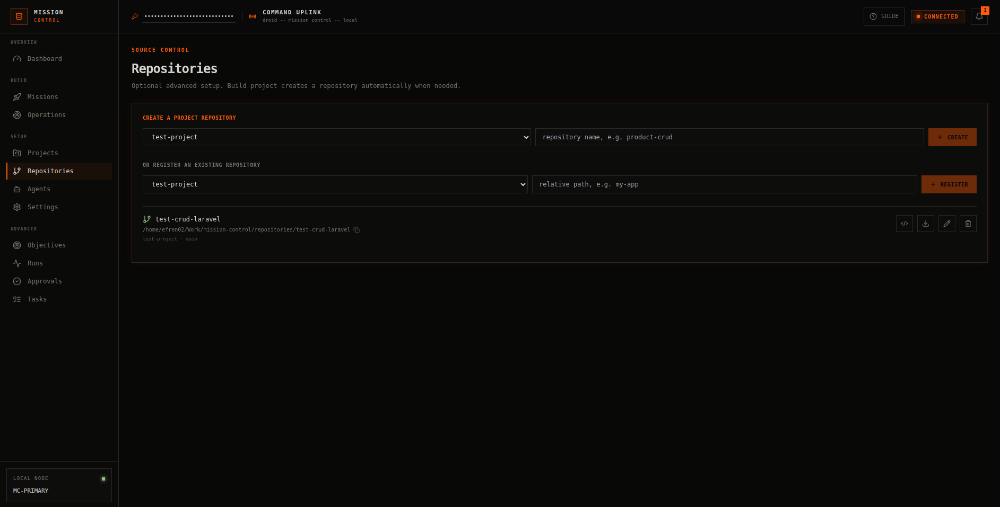

## Create an objective

Open <http://localhost:3000/objectives>, select a project, describe the desired outcome and acceptance criteria, and create the objective. Press `Plan` to create a controlled, read-only planner run that generates proposed tasks for human review.

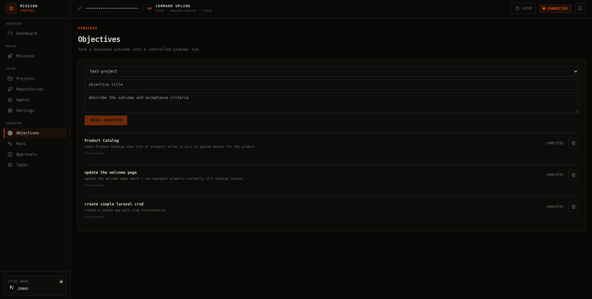

## Persistent project instructions

Use **Settings** to save coding standards that apply to every project. On **Projects**, save
project-specific decisions, constraints, conventions, and operating rules. Every planner run receives
both sets of instructions; project memory takes precedence over a global standard when they conflict.
The values are stored in PostgreSQL and survive service restarts and rebuilds.

## Configure agents and workflow controls

A default roster (Lead Planner, Senior Developer, QA Engineer, and Code Reviewer, all on the
Codex provider) is seeded automatically the first time the API starts with an empty agents
table, so planning and automatic task assignment work without any manual agent setup. Open
**Agents** to create or edit planner, developer, QA, and reviewer profiles. Each profile selects
a provider and optional model, stores role-specific instructions, reports live provider availability,
can run a safe connectivity test, and exposes its invocation history. Generated tasks can be assigned
manually, or automatically by matching their requested role to an enabled agent.

The Code Reviewer owns the final acceptance review, but cannot override deterministic failures. New
plans contain structured acceptance criteria, and building such a plan requires an enabled reviewer.
Reviewer verification cannot edit the repository and is recorded as a separate invocation. The
reviewer receives the persisted test result as evidence, so implementation claims are not treated as
proof and a prose review cannot turn a failing command green.

Each agent profile selects its primary provider and optional model. When **Provider fallback** is
enabled in Settings, planning and read-only verification try the other connected provider once if
the primary provider fails or returns unusable structured output. Write-capable task execution
switches providers only for a provider/gateway failure; an agent-reported project blocker stays a
normal task retry so routing cannot hide a real implementation problem. The fallback uses the
alternate provider's default model because provider-specific model names are not portable.

Every attempt is stored as a separate invocation with its actual provider, model, attempt number,
routing reason, and source provider when it is a fallback. Run events also record the transition and
failure reason, making automatic routing decisions auditable from mission and agent history.

The dashboard's **Provider performance** report aggregates durable mission outcomes by provider and
agent role: completed versus failed invocations, success rate, weighted average duration, fallback
attempts and recoveries, and recorded token usage. Token coverage is displayed beside totals because
older invocations and provider responses without usage metadata remain unknown rather than being
misreported as zero. Gateway-runtime usage remains a separate short-lived capacity view.

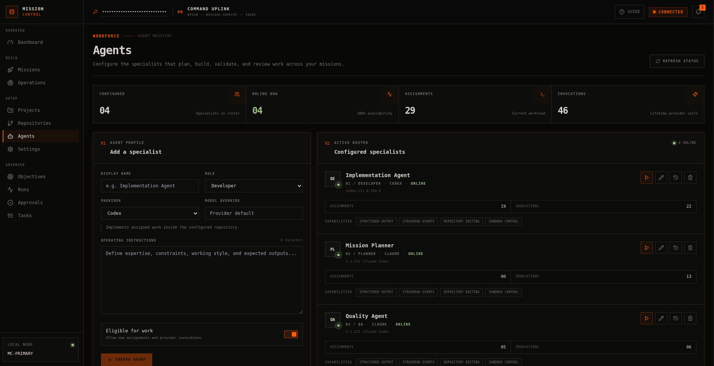

Open **Settings** to configure the planning provider and model, approval gates, automatic
assignment, task limits, provider timeout, output retention, repository-write authorization,
and global coding standards. Each assigned agent profile controls the provider and model used
for its execution tasks. Administrative and gateway tokens remain environment-managed secrets.
Provider sign-in is available from **Settings**; the resulting credentials live in the gateway's
Docker volumes and are intentionally never stored through the dashboard. The **Disposable execution
containers** panel reports sandbox supervisor health, the number of active containers, and the
memory, CPU, and process limits applied to every sandbox.

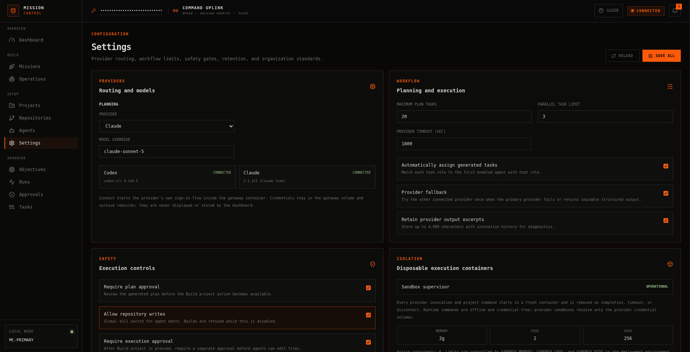

## Run the planner

After creating an objective, press `Plan`. The API returns immediately and the Dramatiq worker
invokes the configured planner through the provider gateway in read-only mode. Generated tasks
appear at <http://localhost:3000/tasks>. A successful plan moves the objective and run to
`awaiting_approval`; no files are edited and no Git operations are performed.

Planning and project-test jobs are first committed to a PostgreSQL dispatch outbox in the same
transaction as their workflow state. The API retries pending outbox records every five seconds.
If Redis is temporarily unavailable, the mission remains durably queued instead of becoming
permanently stuck. On startup, the dispatcher also reconstructs missing jobs for legacy
`planning` runs and `queued` test commands. Actor state claims make duplicate delivery safe.

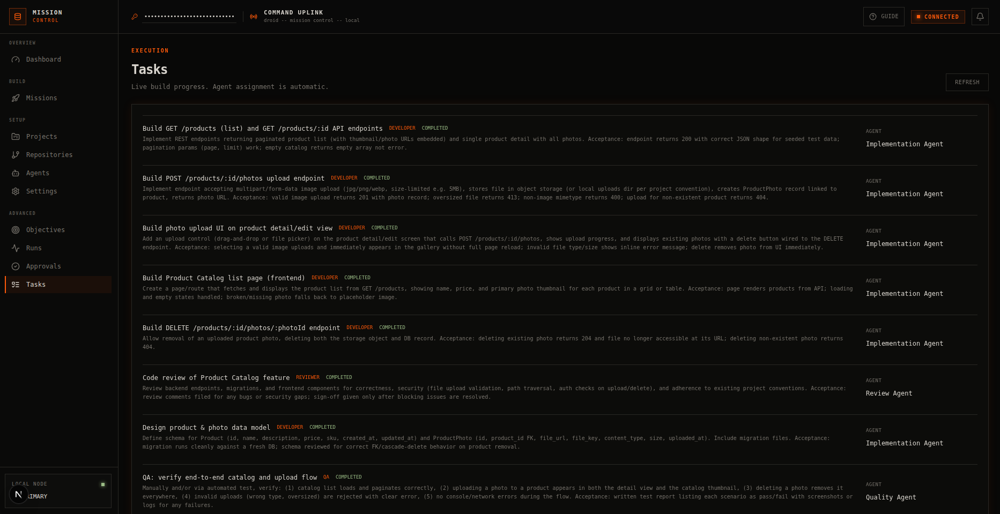

Open <http://localhost:3000/runs> to inspect the durable timeline, generated tasks, provider
invocation input/output excerpts, and errors for each attempt. Open
<http://localhost:3000/approvals> to review the proposed tasks. Approving a plan marks the run
complete and the objective planned; rejecting it records the reason and makes the objective
eligible for another planning attempt.

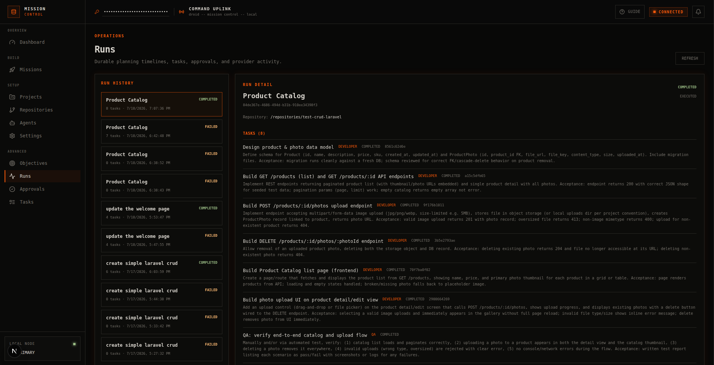

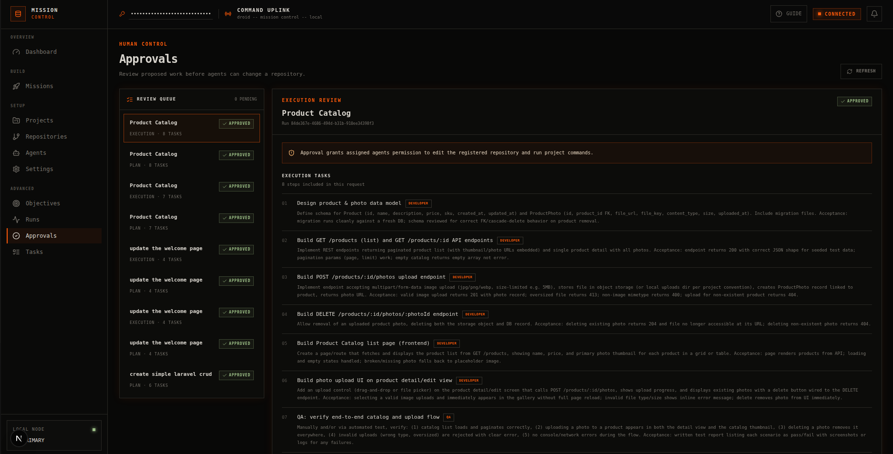

## Execute an approved plan

Open the approved plan at <http://localhost:3000/runs> and press **Build project**. This explicit
action authorizes repository edits, automatically creates a Git repository when the project has
none, assigns the existing project repository when there is one, and immediately queues execution.
Repository management at <http://localhost:3000/repositories> is optional advanced setup for
projects that need a specific existing repository.

The worker processes tasks in plan order because each task builds on the same working tree. After
the last implementation task, a dedicated verification worker runs project tests and then asks an
independent reviewer to verify the approved acceptance criteria before the run can complete. Live
states (`queued`, `in progress`, `completed`, `failed`, or `blocked`) appear on the Tasks and Runs
screens, which refresh every five seconds. Provider input/output excerpts and errors remain
available in the run detail.

Execution edits the selected repository mounted from `REPOSITORY_HOST_ROOT`; the repository path
shown in Runs and Repositories is where the resulting project can be opened on the host. Agents
never run `git commit` themselves; instead, Mission Control saves a checkpoint commit (authored
as "Mission Control") after every completed task, plus one before execution when the working tree
already had changes. When a task fails for good, its partial changes are also committed (as
"Task N (failed): ...") so they stay attributed to that task instead of leaking into the next
mission's baseline. Each task's diff is available from **View changes** on the Missions screen
(or `GET /api/v1/tasks/{id}/diff`), and any checkpoint can be rolled back with normal Git tools,
for example `git revert <sha>`. After a run finishes, **Undo this task** on the Missions screen
(or `POST /api/v1/tasks/{id}/revert`) creates that revert commit for you; the undo is refused if
the working tree is dirty and cancelled cleanly if later changes conflict with it.

While a task runs, the agent's output streams into the Missions screen live (stored as the
rolling invocation excerpt, so it also respects the retention setting). A failed provider
attempt is automatically retried once with the failure fed back to the agent; only a second
failure stops the run and blocks the remaining tasks so partial changes can be inspected before
retrying manually.

Provider and shell commands run in their own process groups. If the API worker disconnects, the
request is aborted, or the configured timeout expires, the gateway terminates the entire process
group and escalates to `SIGKILL` after two seconds. This prevents an abandoned provider from
continuing to edit a repository while an operator resumes the mission.

Provider invocations retain up to 4,000 characters of input and output by default. This can be
disabled in **Settings**. Output from invocations created before retention was enabled cannot be
recovered.

### Isolated mission branches

Execution starts in a run-scoped linked Git worktree on a
`mission-control/run-<run-id>` branch. Agents, task checkpoints, deterministic tests, and the
independent reviewer all operate on that isolated workspace. The registered repository does not
move until every verification gate passes.

After verification, Mission Control integrates the branch with a fast-forward-only merge. It
refuses integration if the registered repository moved from the recorded baseline, either
workspace is dirty, or the worktree metadata does not match. Failed verification and integration
races preserve the mission branch and worktree for inspection; the Missions screen shows that
state explicitly. A successful merge removes the linked worktree and branch. If only cleanup
fails, the run remains completed with a `cleanup_pending` warning because the verified commit was
already integrated.

Within a mission, the planner records one-based task dependencies. Dependency-ready tasks can run
in parallel up to **Settings → Parallel task limit** (three by default). Every parallel task gets
its own `mission-control/task-<task-id>` branch and linked worktree. Completed branches merge
one-at-a-time into the mission worktree; a conflicting merge is aborted completely and the task
branch is preserved for review. Tasks that omit dependency metadata retain sequential behavior,
which keeps older plans safe.

The planner also records the files each task expects to touch. Before a dependency-ready task
starts, Mission Control checks those predicted files against every task already running: when they
overlap, the ready task is held back and serialized behind the running one instead of racing it to
a merge conflict, and a `task.serialized_for_overlap` event is recorded. Tasks with disjoint
predictions still run in parallel, and when predictions are unknown the merge-time conflict
handling above remains the safety net.

When a task merge conflicts, Git aborts the merge before the mission workspace can retain partial
changes. Mission Control stores the exact unmerged filenames, preserves the task worktree, and
creates a **task integration** approval. The mission task panel can load a read-only comparison of
the task patch and files changed on the mission branch. An operator can select an enabled
developer, QA, or reviewer agent and add resolution guidance. Mission Control prepares the real
merge inside the preserved task worktree; the selected agent can edit only that isolated
workspace. The result must produce a resolution checkpoint and pass the configured or detected
project test command (or record explicitly that no test command exists). Agent output, test
output, commit IDs, and failures remain attached to a durable resolution attempt.

**Retry merge** stays explicit and approval-gated. It is unavailable until the latest assisted
resolution passes, and the resolver never integrates into the mission branch itself. If later
mission changes produce another conflict, the approval remains pending and both branches stay
preserved for another reviewed attempt.

If two missions target the same repository baseline, the first verified mission may fast-forward
the repository; the second is preserved for review instead of being merged automatically.
Fresh per-run containers remain a later Phase 3 increment.

## Continuous operations

Once isolation and verification are reliable, Mission Control can look for valuable work on its
own instead of waiting for a written prompt. The **Operations** screen manages scheduled
maintenance checks and the findings they produce. Continuous operations is **off by default** and
is enabled in **Settings → Continuous operations**; until then, schedules never run on their own,
though you can still trigger any one with **Run**.

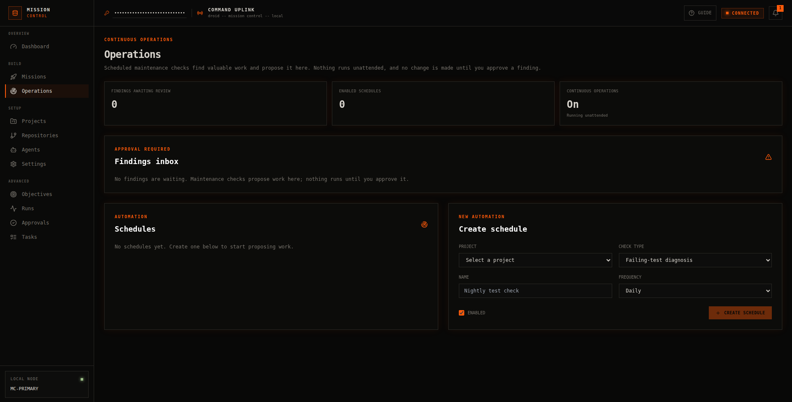

The screen shows how many findings await review, how many schedules are enabled, and whether
continuous operations is currently allowed to run unattended.

A schedule binds a check to a project on a fixed cadence. The available checks are failing-test
diagnosis, dependency maintenance, security checks (`npm audit` and committed-secret scanning),
repository health (missing `.gitignore`, large tracked files), documentation drift, GitHub issue
triage, and recurring mission templates. Checks run on the worker inside the same credential-free
runtime gateway as project tests; a check that cannot run in the current environment (for example
issue triage without a GitHub remote or the `gh` CLI) is recorded as **skipped**, not failed.

Every check produces **findings** rather than actions. A finding describes what was discovered and,
for most checks, a proposed objective drafted from the evidence. Findings appear in the Operations
inbox as a notification requiring approval. The model is strictly propose-only: **nothing executes
until you approve a finding.** Approving one creates an objective from the proposal and starts
planning, which then flows through the normal plan, verification, and integration gates, including
plan and execution approvals. Dismissing a finding resolves it; a persistent problem can resurface
on the next run, and a recurring mission template proposes its objective again on schedule.

The scheduler runs alongside the API using the same transactional outbox as the rest of the
platform, so no new infrastructure is required. Detector executions and their results are recorded
for observability, and any provider reasoning (diagnosis, repair proposals, triage) is attributed
as agent invocations in the usual usage analytics.

## Open, run, and download the built project

After a mission has built a repository, its completion panel includes **Open in VS Code**,
**Run tests**, and **Run app**.

### Open the project in VS Code

**Open in VS Code** appears on the mission completion panel and on every entry of the Repositories
page. It opens the repository's real path on your machine using the `vscode://file/...` protocol
handler, so the editor loads the working tree directly rather than a copy. It needs VS Code
installed on the host and the browser allowed to hand the link to it; the first click usually asks
for that permission once.

The button is shown only when Mission Control can resolve a host path for the repository. That
mapping comes from `REPOSITORY_HOST_ROOT` (absolute, or relative to `MISSION_CONTROL_HOST_ROOT`,
which Compose sets to the directory you start the stack from). The default `./repositories` works
without any change. If the value is missing or the repository resolves outside the configured root,
the action is hidden instead of producing a broken link, and the Repositories page still shows the
container path so you can copy it.

### Download the project

The download action on the Repositories page returns a zip of the repository as committed at `HEAD`,
named `<repository>-<short-sha>.zip`. It is produced with `git archive`, so untracked and ignored
files, along with the `.git` directory itself, are excluded; what you get is the committed state,
not the working tree. The same archive is available from
`GET /api/v1/repositories/{repository_id}/archive` with the admin token. Because Mission Control
saves a Git checkpoint after every completed task, the repository on disk stays the full history,
and normal Git tooling remains the way to move a project somewhere else.

### Run tests and preview the app

Test runs are queued on the worker, executed inside the credential-free runtime gateway against
the writable repository mount, and shown on the mission as a live rolling output excerpt. A
nonzero exit code is recorded as a failed test run without changing the mission or build status.
The runtime service starts in `runtime-only` mode, where provider execution, login, and Git
mutation endpoints are rejected even with a valid runtime token.

Mission Control detects these defaults when the project command is empty:

- Node projects with a `test` script: `npm test`
- Node projects with a `dev` script: `npm run dev -- --host 0.0.0.0 --port $PORT`
- Laravel projects: `php artisan test` and
  `php artisan serve --host 0.0.0.0 --port $PORT`

Use **Projects** to override either command. An empty field restores auto-detection. Commands
run through `sh -c` inside the runtime gateway and should be treated as trusted project
configuration. App commands should listen on `0.0.0.0` and use `$PORT`; the gateway substitutes
an available port from `8201` through `8210`. While the app is running, **Open app** launches its
local preview and **Stop app** terminates the app process group.

Preview processes are intentionally local and ephemeral. Restarting the runtime gateway stops
them, and at most ten apps can run concurrently with the default Compose port range. Change
`PROVIDER_GATEWAY_APP_PORT_RANGE` and the matching `ports` mapping in `compose.yaml` together if
you need a different range.

### Command trust boundary

Test commands execute repository-controlled scripts in a fresh container requested through the
credential-free `runtime-gateway`. Each test container has no network, provider credentials, or
Docker socket, and its environment is allowlisted so gateway tokens are not inherited. Preview
commands remain in the hardened runtime gateway so their localhost port can stay available until
the operator stops them. Only register repositories and run commands you trust: scripts retain
write access to their mounted repository. Preview ports remain bound to localhost.

Disposable containers have a read-only root filesystem, drop all Linux capabilities, enable
`no-new-privileges`, use an init process, and default to 2 CPUs, 2 GB memory, and 256 processes.
Their writable `/tmp` and HOME are memory-backed filesystems. `SANDBOX_CPUS`, `SANDBOX_MEMORY`,
and `SANDBOX_PIDS` control these limits. Containers are force-removed after completion, timeout,
or client disconnect. Registered repositories and the
shared mission-worktree volume remain the only persistent writable mounts.

Runtime networking is default-deny. The gateway shares an internal `runtime-plane` only with the
API and worker, so project commands cannot directly resolve PostgreSQL, Redis, or the provider
gateway. A separate runtime-only bridge preserves localhost port publishing but disables IP
masquerading, so it provides no usable route to internet hosts. This blocks dependency downloads
and external APIs during tests and previews.

For a trusted project that genuinely requires internet access, start the stack with the explicit
egress override:

```bash
make up-runtime-egress
```

The override enables masquerading on the runtime-only bridge. It does not join the gateway to the
database/provider `control-plane`. Egress permission applies to every runtime test and preview
while that Compose configuration is active. Stop the stack with `make down` before switching modes;
return to default-deny mode with `make down` followed by `make up`.

Both gateways run with `SANDBOX_REQUIRED`, so provider invocations and test commands are refused
rather than falling back to in-gateway execution when the sandbox supervisor is unavailable. The
gateways themselves remain long-lived containers, and preview processes still run inside the runtime
gateway so their localhost port stays reachable. Per-mission network policies remain future
hardening. Adjust the resource values in `compose.yaml` when a trusted project legitimately needs
more capacity.

## Upgrade an existing checkout

Pull the new source, rebuild the affected services, and apply migrations:

```bash
docker compose build migrate provider-gateway runtime-gateway
docker compose run --rm migrate
docker compose up -d --build api worker web provider-gateway runtime-gateway
```

The dispatch migration creates the durable outbox. The state-invariant migration adds database
constraints for workflow statuses, agent roles/providers, pending approvals, and concurrent test
runs. Both migrations use transactional PostgreSQL DDL.

Provider login commands are interactive. If a browser cannot reach the container callback, copy
the displayed URL or code into your host browser and paste the result back into the terminal.
Claude also supports `claude setup-token` for a long-lived subscription OAuth token in
automation, but do not commit that token to `.env` or source control.

Check provider availability:

```bash
docker compose up -d provider-gateway
docker compose exec provider-gateway codex login status
docker compose exec provider-gateway claude auth status --text
```

Check the authenticated gateway API by copying `PROVIDER_GATEWAY_TOKEN` from `.env`:

```bash
curl http://localhost:8100/health
curl http://localhost:8100/v1/providers \
  -H "Authorization: Bearer <PROVIDER_GATEWAY_TOKEN>"
```

The credential-free runtime gateway has a separate health endpoint and token:

```bash
curl http://localhost:8110/health
```

Run the safe read-only smoke execution against the shared workspace:

```bash
curl -N -X POST http://localhost:8100/v1/execute/stream \
  -H "Authorization: Bearer <PROVIDER_GATEWAY_TOKEN>" \
  -H "Content-Type: application/json" \
  -d '{"provider":"codex","workspace":"/workspaces","prompt":"Describe this workspace in three concise bullets. Do not edit files."}'
```

The response is Server-Sent Events with `started`, `stdout`, `stderr`, and `completed` events.
Completion metadata reports timeout and client-disconnect cancellation separately.

## Reliability and security model

- REST routes require `LOCAL_ADMIN_TOKEN`, except liveness/health and the guarded development
  auto-login endpoint.
- The realtime WebSocket requires an allowed origin and the admin token in the
  `Sec-WebSocket-Protocol` header. The token is not placed in the WebSocket URL.
- The gateway requires its separate `PROVIDER_GATEWAY_TOKEN`, validates canonical workspace
  paths under `/workspaces`, and runs without a Docker socket.
- Only the sandbox supervisor receives the Docker socket. Its API accepts fixed execution kinds,
  validates sandbox IDs and workspace paths, constructs all mounts and security flags itself, and
  never accepts arbitrary images, mounts, networks, or Docker arguments.
- The runtime gateway uses an independent `RUNTIME_GATEWAY_TOKEN`, receives no provider credential
  volumes, and exclusively handles project tests and preview processes. Disposable test containers
  are always offline; the trusted-egress override applies only to preview processes.
- Provider fallback is bounded to one alternate-provider attempt and records both routes; it does
  not repeatedly cycle between providers.
- Planning is read-only. Repository writes require the global write setting plus the configured
  approval gates.
- Workflow status values and important concurrency rules are enforced in PostgreSQL as well as
  in application code.
- Planning and test publication survives Redis interruptions through the transactional outbox.
- Run-scoped Git worktrees isolate edits until tests and independent review pass; fast-forward-only
  integration prevents silent overwrites when the source repository moves.
- Dependency-aware task worktrees allow bounded parallel execution while merge conflicts remain
  isolated and recoverable. Tasks predicted to touch overlapping files are serialized before
  execution instead of racing to a conflict.
- Task integration conflicts retain structured file evidence, run assisted resolution with
  durable test evidence in the preserved task worktree, and require explicit approval before a
  merge retry.
- Continuous operations is off by default and strictly propose-only: scheduled maintenance checks
  create findings that require explicit approval before any objective is planned or executed.
- Git checkpoints make completed and failed task changes attributable and reversible.
- Repository archives and host-path resolution are read-only and confined to the configured
  repository root. Opening a project in VS Code is a client-side protocol link; the API never
  launches an editor.
- Mission image attachments are validated by file signature rather than the declared content type,
  and are capped per mission in count and size.

## Common commands

```bash
make up
make up-runtime-egress  # trusted projects that require outbound internet access
make test
make lint
make migrate
make down
```

## Architecture boundaries

- `api` accepts input and delegates application behavior.
- `worker` executes durable background work through Dramatiq.
- `dispatch_jobs` is the PostgreSQL outbox between committed workflow state and Redis delivery.
- `domain` remains independent of FastAPI, SQLAlchemy, Redis, and AI providers.
- `application/ports` defines execution and provider contracts.
- `infrastructure` implements external integrations.
- The provider gateway is a dedicated non-root container with explicitly mounted workspaces.
- The runtime gateway is a separate non-root container with repository access but no Claude or
  Codex credential volumes.
- Planning is read-only. Repository editing is available only through the execution state machine,
  with the global write setting enabled and (by default) a separate execution approval.

The API, worker, and both gateways never receive an unrestricted Docker socket.
